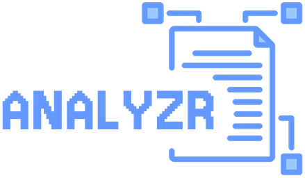

  

## About Me

CS student at La Rochelle University. Passionate about full-stack development and 3D Modeling.
- Interested in machine learning & automation

## Featured Projects

*Click an image to open its repository.*

|                                                           Name                                                            | Description                                                                                |
|:-------------------------------------------------------------------------------------------------------------------------:|:-------------------------------------------------------------------------------------------|
|                      | CI/CD skills suite to set up pipelines with GitLab CI, GitHub Actions, or Azure Pipelines. |

## Technical Skills

<table>
  <tr>
    <td align="center"><strong>Frontend</strong></td>
    <td>     </td>
  </tr>
  <tr>
    <td align="center"><strong>Backend</strong></td>
    <td>   </td>
  </tr>
  <tr>
    <td align="center"><strong>Databases</strong></td>
    <td>  </td>
  </tr>
  <tr>
    <td align="center"><strong>Systems</strong></td>
    <td>  </td>
  </tr>
  <tr>
    <td align="center"><strong>Cloud & DevOps</strong></td>
    <td>    </td>
  </tr>
  <tr>
    <td align="center"><strong>Tools</strong></td>
    <td>  </td>
  </tr>
</table>

## Socials

[![LinkedIn](https://img.shields.io/badge/LinkedIn-0f172a?style=for-the-badge&logo=)](https://www.linkedin.com/in/salimzidane/)

